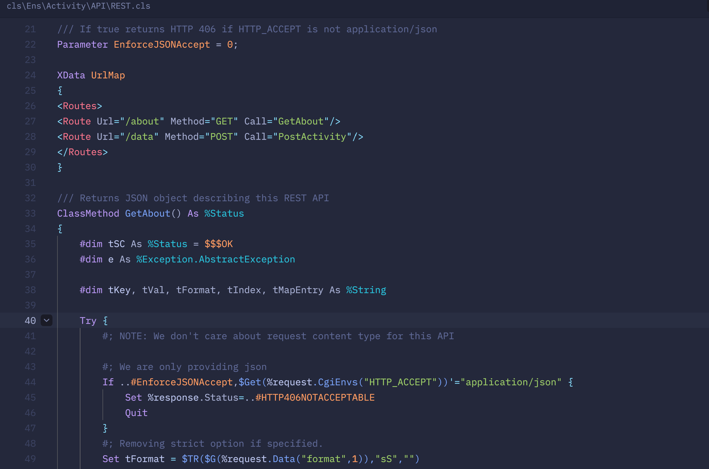
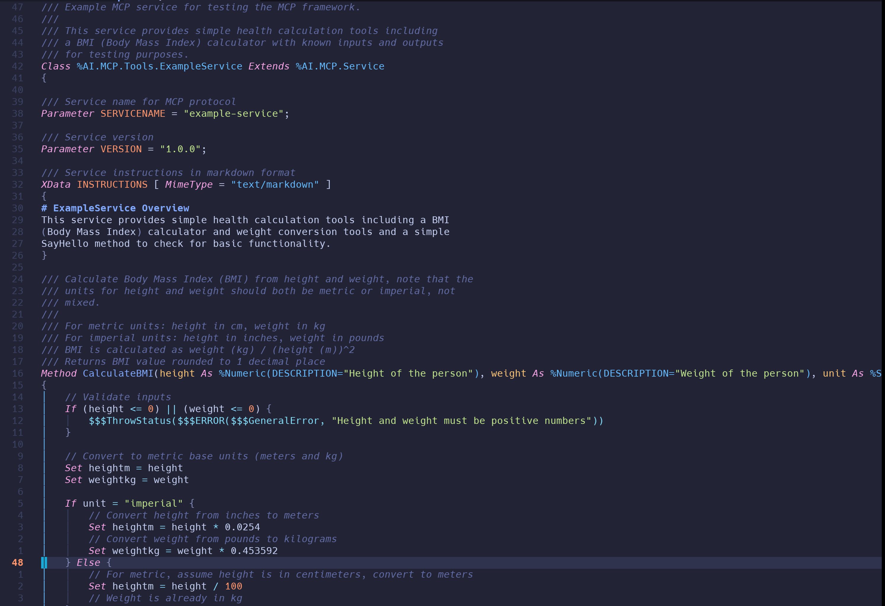

# tree-sitter-objectscript

A tree-sitter parser for InterSystems ObjectScript.

[](https://conventionalcommits.org)

## Introduction

This project provides a [Tree-sitter](https://tree-sitter.github.io/tree-sitter/) grammar for [InterSystems ObjectScript](https://docs.intersystems.com/latest/csp/docbook/DocBook.UI.Page.cls?KEY=GCOS_intro), enabling fast and precise syntax parsing for use in code editors, linters, and developer tooling.

**Tree-sitter** is a powerful parser generator and incremental parsing library widely used in modern development environments to deliver real-time syntax highlighting, structural editing, and code analysis. It constructs concrete syntax trees quickly and efficiently, even as code changes.

**InterSystems ObjectScript** is a dynamic, multi-paradigm programming language that combines procedural and object-oriented approaches with a novel multi-model data access features for key-value, SQL, Object and Document stores. It is the core language for the InterSystems IRIS Data Platform, particularly well-known in mission-critical applications in healthcare, financial services, and other data-intensive domains.

The grammar currently integrates with these editors:
- [zed.dev](#zeddev)
- [neovim](#neovim-nvim-treesitter)
- [emacs](#emacs)

## Screenshots

### Zed


### Neovim



## Editor Integrations

### zed.dev

Integration with the Zed editor is done as a [Zed Extension for ObjectScript](http://github.com/intersystems/zed-objectscript).  Once we've added this to the official zed-extensions repo, installation can be done via the Zed Extensions panel and simply search for ObjectScript.  Note that given the sophistication of the tree-sitter-objectscript grammar, installation can take 1-2 minutes for Zed's WASM infrastructure to build the parser.

### Neovim (nvim-treesitter)

**NOTE:** The normal process for nvim-treesitter integration is for the grammar author to fork nvim-treesitter, add a few lines to make the grammar known and submit a PR, after which it's just a simple question of `TSInstall ...`.  However, as of writing, the nvim-treesitter project has archived it's main branch and isn't taking PRs while they rewrite the project.

At some point when they've completed that work, we'll integrate this directly, but in the meantime, you need to follow the manual steps outlined below.

#### Pre-requisites

Before using, you need to have [nvim-treesitter](https://github.com/nvim-treesitter/nvim-treesitter) plugin installed with your favorite
package manager, here we use LazyVim.

#### Configuration

Add the following to `init.lua`, or, in the case you are using LazyVim, to your `config/autocmds.lua` file.

```lua
local parser_config = require("nvim-treesitter.parsers").get_parser_configs()
parser_config.objectscript_udl = {
  install_info = {
    url = "https://github.com/intersystems/tree-sitter-objectscript",
    files = { "src/parser.c", "src/scanner.c" }, 
    branch = "main",
    location = "udl",
  },
}
vim.filetype.add({
  extension = {
    cls = "objectscript_udl",
  },
})
vim.treesitter.language.register("objectscript_udl", "objectscript_udl") 
```

You will need to copy in the `*.scm` files, these go into the nvim-data directory which depends on if you're using Windows or UNIX
(and if you're using LazyVim or another package manager).

The best place to get these currently is https://github.com/intersystems/zed-objectscript/languages/objectscript_udl/*.scm and 
copy them into:

* UNIX: `~/.local/share/nvim/lazy/nvim-treesitter/queries/objectscript_udl/...`
* Windows: `%USERPROFILE%\Local\nvim-data\lazy\nvim-treesitter\queries\objectscript_udl\...`

#### Installation

Open a new instance of NeoVim and type `:TSInstall objectscript_udl` to install the tree-sitter-objectscript parser.  After this completes you should be able to open `*.cls` files.  If no coloring shows up, it probably means you haven't copied the `*.scm` files as described above.

**NOTE**: On Windows, if the parser is currently in-use, nvim-treesitter will fail to update it; simply exit any nvim sessions and start a new one to redo the `:TSInstall objectscript_udl` command.

#### Testing

Open up a .cls file in NeoVim:
```bash
~ $ nvim foo.cls
```
Highlighting should be automatic. If not, use `:TSBufEnable highlight`.

### Emacs
_TODO: Add configuration instructions._

## Reporting Issues

Please report issues via [GitHub Issues](https://github.com/your-repo-url/issues).

## Contributing

Contributions are welcome. Please submit changes via Pull Requests. Our preference is to use [Conventional Commits](https://www.conventionalcommits.org/en/v1.0.0/) for commit messages in order to keep the summaries terse, but allowing for more detail on the subsequent lines of the commit message.

### Project Structure

There are three main grammars in this repository:
- **expr**: Handles ObjectScript expressions.
- **core**: Core ObjectScript "routine" syntax (e.g., lines of code).
- **udl**: Grammar for the `.cls` files that IRIS uses for storing ObjectScript classes.

The reason behind the multiple grammar architecture is that there are cases where we need to inject ObjectScript
expressions as well as lines of ObjectScript into other grammars (see future work below).

## License

This project provided as-is and is licensed under the MIT License.

## Future Work

Future plans include creating a grammar for CSP by extending HTML and injecting `expr` and `core` grammar elements
to support `#(<expr>)#` and `<script language="cache" runat=server>...</script>` blocks of ObjectScript.

